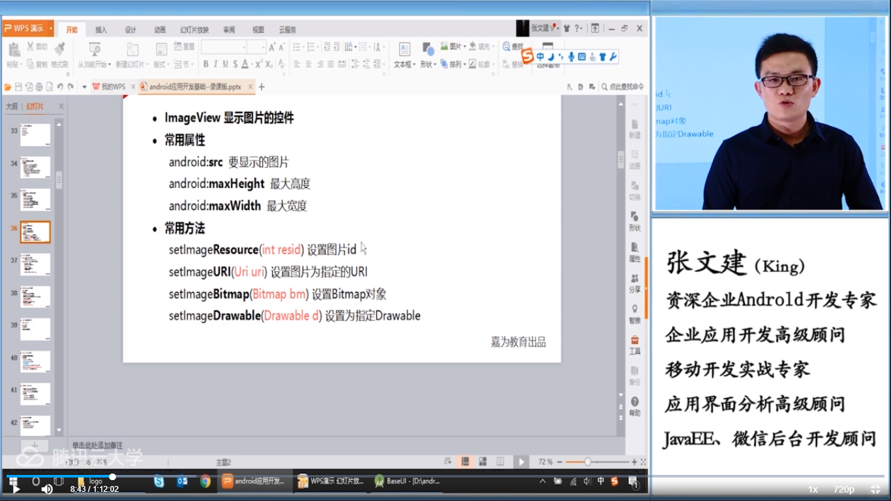

#   Android应用开发基础将介绍以下内容：

- 初始Android开发
- 界面布局技巧
- 核心编程基础
- 基础编程进阶

##    本节课Android应用开发概述将介绍以下内容：

- Android应用开发简介
- Android应用程序的开发特点
- Android应用开发的系统架构
- Android应用领域

   **Android应用开发简介——版本**

- Android 4.0 Ice Cream Sandwich（冰淇凌三明治）
- Android 5.0 Jelly Bean（果冻豆）
- Android 6.0 Key Lime Pie（柠檬派）
- Android 7.0 Nougat（牛轧糖）

   **Android应用开发特点**

- 开放、开源的平台
- 采用Java语言开发，依托Java丰富的编程资源
- 应用程序互相平等，其它组件是可以之间互换的
- Android平台支持丰富的硬件
- 集成了基于开源WebKit引擎的浏览器

   **Android系统架构**

   分为应用层、应用框架层、系统库，系统库包含程序库和Android核心包、硬件抽象层、Linux内核。

   **Andoid应用领域**

- 手机行业
- 平板
- 智能手表
- 智能眼镜
- 智能家具


# 1.安卓系统框架结构

1.linux2.6内核

2.硬件抽象层

3.Android系统库和运行时环境

4.应用框架层

5.应用层


# 2.获取屏幕尺寸

## Anndroid常用的尺寸单位的使用将介绍以下内容：

- PX
- DP
- SP
- 代码获取屏幕实际尺寸
- DP与PX之间的转换

   **PX**

   PX相当于实际屏幕的像素，由于不同屏幕的像素数差异比较大，因此这个单位很少使用。示例：320*480的屏幕，表示在横向有320个像素，在纵向有480个像素。

   **DP**

   DP称之为与密度无关的尺寸单位。它在不同密度的屏幕中实际显示比例将保持一致，1dp相当于160dpi屏幕中的1px。

- 120dpi   1dp = 0.75px
- 160dpi   1dp = 1px
- 240dpi   1dp = 1.5px
- 320dpi   1dp = 2px

   **SP**

   SP和DP是比较相似的，但是它会随着用户对系统字体大小的设置进行比例缩放，所以它更加适合作为字体大小。

   **获取屏幕尺寸**

```java
//获取系统管理器
WindowManager manager = (WindowManager) getContext().
      getSystemService(Context.WINDOW_SERVICE);
//获取显示器
Display defaultDisplay = manager.getDefault();
//获取屏幕宽度
screenWidth = defaultDisplay.getWidth();
//获取屏幕高度
screenHeight = defaultDisplay.getHeight();
```

   **DP与PX间的转换**

```java
//根据手机的分辨率从dp的单位转成为px（像素）
public static int dip2px(Context contexxt,float dpValue){
   final float scale = context.getResources().
             getDisplayMetrics().density;
   return (int) (dpCalue * scale + 0.5f);
}
//根据手机的分辨率从px（像素）的单位转成为dp
public static int px2dip(Context contexxt,float dpValue){
   final float scale = context.getResources().
             getDisplayMetrics().density;
   return (int) (dpCalue * scale + 0.5f);
}
```


3.UI

## Android基本UI组件将介绍以下内容：

- TextView 不可编辑的文本视图
- EditText 可编辑输入框，是TextView的子类文本输入框
- ImageView 图片
- Button 按钮

   **TextView**

   常用属性：

- android:gravity 在x轴和y轴的显示方向
- android:hint 内容为空时显示的文本
- android:typeface 文本字体
- android:ellipsize 显示内容超出长度时如何省略


   **EditText**

   常用属性：

- andoird:lines 固定的行数
- android:maxLines 最大行数
- android:minLines 最小行数
- andoird:password 是否显示为密码
- andoird:phoneNumber 内容只能是号码
- andoird:scrollHorizontally 是否可以水平滚动
- android:singleLine 单行模式
- android:maxLength 最大长度

   **ImageView**

   常用属性：

- andoird:src 要显示的图片
- android:maxHeight 最大高度
- android:maxWidth 最大宽度

   常用方法：

- setImageResource(int resid) 设置图片ID
- setImageURL(Uri uri) 设置图片为指定的URL
- setImageBitmap(Bitmap bm) 设置Bitmap对象
- setImageDrawable(Drawable d) 设置为指定Drawable

   **Button**

   可以添加View.OnClickListener

   ToggleButton Button子类 状态按钮：

- android:textOff 按钮未被选中时显示的文本
- android:textOn 按钮被选中时显示的文本
- 可添加的监听 OnCheckedChangeListener





##  Android基本UI组件

   连接上节课，本节课将介绍：

- ProgressBar 
- CheckBox
- 时钟组件
- 日期时间选择组件

   **ProgressBar**

   常用单独的线程来设置进度

   XML属性：

- android:max 最大进度
- android:progress 当前进度

   进度条风格设置

```js
style="@android:style/Widget.ProgressBar"
@android:style/Widget.ProgressBar.Horizontal
setProgress()   代码中设置当前进度
```

   **SeekBar RatingBar**

   SeeiBar  ProgressBar的子类拖拉条  添加监听 OnSeekBarChangeListener

   RatingBar   ProgressBar的子类  星级滑块  添加监听OnRatingBarChangeListener

   RatingBar XML属性：

- android:max 全部星块数量
- android:rating 初始星块数量

   **CheckBox**

   是Button的子类，XML属性为android:checked 初始时是否选中。CheckBox注册监听OnCheckedChangeListener，选中状态改变时触发监听器。

   时钟组件

- AnalogClock 模拟时钟
- DigitalClock 数字时钟 TextView的子类

   **TimePicker时间选择器**

   常用方法：

- getCurrentHour() 获取当前小时
- getCurrentMinute() 获取当前分钟
- is24HourView() 是否是24小时制
- setls24HourView(boolean b) 设置24小时制
- setCurrentHour(int h) 设置小时
- setCurrentMinute(int m) 设置分钟
- setOnTimeChangedListener(TimePicker.onTimeChangedListener l) 监听


## Android适配器布局ListView，GridView详解

   本节课将介绍以下内容内容：

- 适配器详解
- ListView
- GridView

   **适配器详解**

   Adapter适配器

- 数据与UI组件分离
- MVC架构模式

  

   常用的Adapter适配器：

- SimpleAdapter 列表适配器
- ArrayAdapter 数组适配器